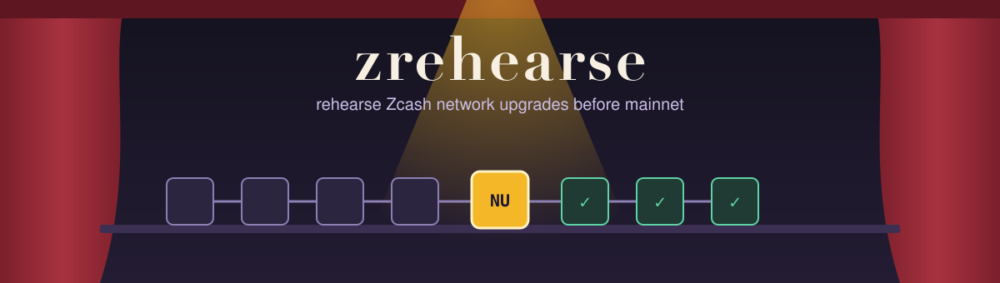
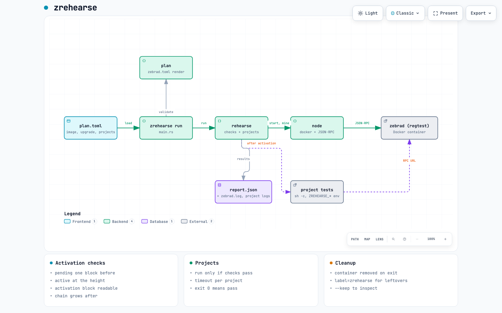

<p align="center"></p>

# zrehearse

Network upgrade rehearsals for downstream Zcash projects.

A Zcash network upgrade changes the consensus rules at a fixed block height ([ZIP 200](https://zips.z.cash/zip-0200)). Each upgrade has its own consensus branch ID, and transaction signatures commit to it. Wallets, SDKs and light servers that build transactions or serve blocks must follow the new rules from the activation height onward. If they do not, they break when the upgrade activates.

zrehearse moves that moment to your CI. It starts a throwaway regtest Zebra node with one upgrade set to activate at a height you pick. It mines across that height and checks that the upgrade really took effect. Then it runs your own test command against the node and reports pass or fail.

## Quick start

You need Docker and a Rust toolchain that supports edition 2024.

```sh
docker pull zfnd/zebra:6.2.3
cargo run -- run examples/nu6_3.toml
```

Output from a real run:

```
rehearsing NU6.3 at height 20 on zfnd/zebra:6.2.3
PASS  previous upgrade in force before activation  (tip 19, chaintip 5437f330, expected NU6.2 branch 5437f330)
PASS  pending one block before activation  (tip 19, status "pending", nextblock 37a5165b, expected branch 37a5165b)
PASS  active at the activation height  (tip 20, status "active", chaintip 37a5165b)
PASS  activation block is readable  (hash 4d08f84d...)
PASS  chain grows after activation  (tip 25, expected 25)
PASS  project rpc-smoke  (exit 0, 0.2s, log out/nu6_3/project-rpc-smoke.log)
REHEARSAL PASSED  report: out/nu6_3/report.json
```

`examples/failing_project.toml` is the negative control. The node activates the upgrade fine, but its project exits with code 3, so the whole run fails.

## The plan file

```toml
name = "nu6.3 on zebra 6.2.3"

[node]
image = "zfnd/zebra:6.2.3"

[upgrade]
name = "NU6.3"
previous = "NU6.2"
height = 20
blocks_after = 5

[[project]]
name = "my-wallet"
run = "cargo test --test upgrade -- --nocapture"
timeout_secs = 900
```

| Field | Default | Meaning |
|---|---|---|
| `name` | required | Free text, copied into the report |
| `node.image` | required | Zebra image to run. The image must know both upgrade names. |
| `node.miner_address` | `tmSRd1r8gs77Ja67Fw1JcdoXytxsyrLTPJm` | Regtest address that receives block rewards (the same one Z3 uses) |
| `node.ready_timeout_secs` | `120` | How long to wait for zebrad's RPC to answer |
| `upgrade.name` | required | The upgrade under test, as Zebra names it, for example `NU6.3`. NU5 and later are supported. |
| `upgrade.previous` | required | The upgrade active before it, for example `NU6.2` |
| `upgrade.height` | required | Activation height, 3 or more |
| `upgrade.blocks_after` | `10` | Blocks to mine after activation, before projects run |
| `project.name` | required | Letters, digits, `-` and `_`. It names the log file. |
| `project.run` | required | Shell command, run with `sh -c` from the plan file's directory |
| `project.timeout_secs` | `600` | The project fails if it runs longer. zrehearse then stops the `sh` process, but not the processes that `sh` started. |

The node config sets only two heights. `previous` activates at height 2, and the upgrade under test activates at your height. Zebra activates the upgrades before `previous` at height 2 or lower. Later upgrades are left out, so they never activate. zrehearse has no list of upgrades. Zebra checks the names and their order.

## What gets checked

zrehearse reads `getblockchaininfo` and compares it with the plan.

1. One block before the activation height, `consensus.chaintip` is the branch ID of `previous`.
2. At the same tip, the upgrade is `pending` at the planned height, and `consensus.nextblock` is its branch ID.
3. At the activation height, the upgrade is `active` and `consensus.chaintip` is its branch ID.
4. `getblock` can return the activation block.
5. After mining `blocks_after` more blocks, the tip is where it should be.

Projects run only when all five pass. If the node never reached the planned state, a project failure would tell you nothing about your code, so projects are marked skipped instead.

## What your project gets

The project command runs with these environment variables.

| Variable | Example |
|---|---|
| `ZREHEARSE_RPC_URL` | `http://127.0.0.1:32768` (zebrad JSON-RPC, no auth) |
| `ZREHEARSE_UPGRADE` | `NU6.3` |
| `ZREHEARSE_ACTIVATION_HEIGHT` | `20` |
| `ZREHEARSE_BRANCH_ID` | `37a5165b`, as zebrad reports it |
| `ZREHEARSE_PREVIOUS_UPGRADE` | `NU6.2` |
| `ZREHEARSE_PREVIOUS_BRANCH_ID` | `5437f330`, as zebrad reports it |
| `ZREHEARSE_TIP` | `25` |

Exit code 0 means pass. Anything else, or a timeout, means fail.

## Output

Everything goes to `out/<plan file name>/`, for example `out/nu6_3/` for `examples/nu6_3.toml`, or to the directory you pass with `--out`.

- `report.json` has every check and project result.
- `zebrad.log` holds the last 300 lines of the node's log.
- `project-<name>.log` holds each project's stdout and stderr.
- `zebrad.toml` is the config the node ran with.

The process exits with 0 when the rehearsal passed, 1 when a check or project failed, and 2 when the rehearsal could not run at all (for example when Docker is missing or the plan is invalid).

## Architecture



An interactive version is in `docs/architecture.html`.

zrehearse calls the `docker` CLI rather than the Docker API, because every machine that can run the rehearsal already has it. The container is removed when the run ends, including when it fails. Each container carries the label `zrehearse`, so if you interrupt a run with Ctrl-C you can clean up with `docker rm -f $(docker ps -aq --filter label=zrehearse)`. Pass `--keep` to leave the node running for inspection.

## Rehearsing a new upgrade

A new upgrade needs no change to zrehearse. Point a plan at a Zebra image that knows the upgrade, and set `name` and `previous`.

## Not built yet

- Shadow forks. The chain starts empty, not from a copy of mainnet state.
- Light servers. Zaino or lightwalletd in front of the node, so wallet SDKs can sync through them.
- A transaction generator that sends every transaction type across the activation height.
- Windows. Projects run under `sh`.

## Development

The tests in `tests/rehearse.rs` run real rehearsals, so they need Docker and the Zebra image. One rehearses `examples/nu6_3.toml` and must pass. The other rehearses `examples/failing_project.toml` and must fail.

```sh
cargo clippy --all-targets -- -D warnings
cargo test                                # unit tests
cargo test --test rehearse -- --ignored   # real rehearsals
```
